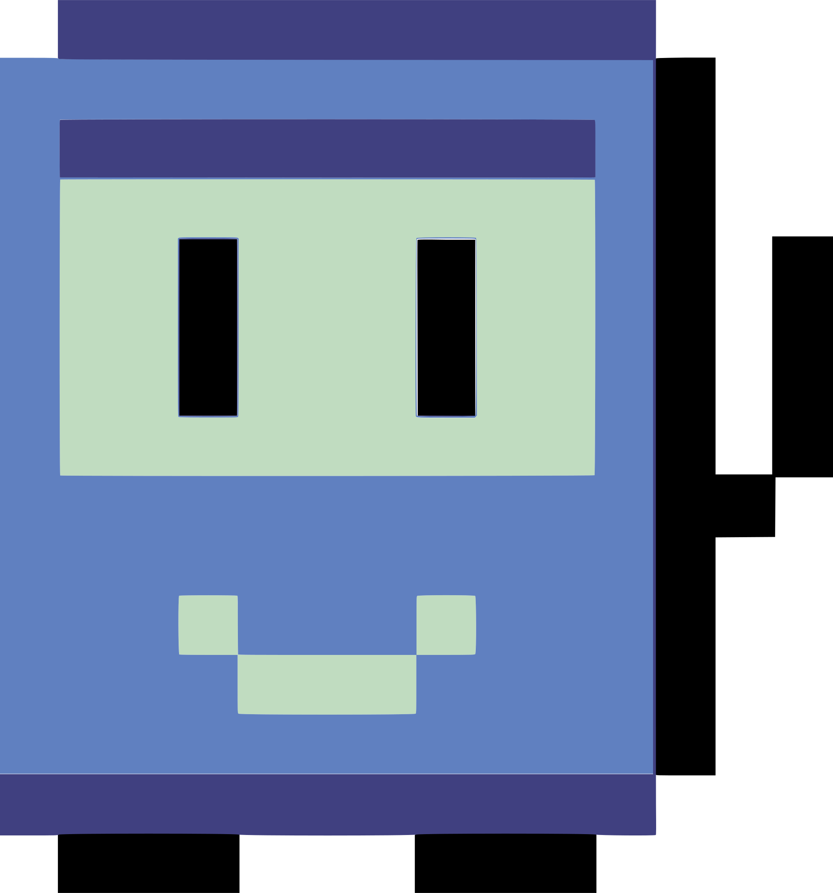

<main> 
  <a href="https://github.com/nikolaslopes">
  <h2>Hi, I'm Nick! </h2>
<!--    -->
    
  

   

      
      
   

    
  

   
  

     
   
   
  

    
    
    
    
    
    
    
    
    
      
      
    
  

   
    
    
 

    
    
  

      
   
    
</main>
